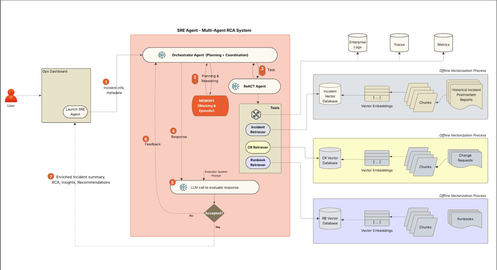

# SREnity - Enterprise AIOps Copilot



**SREnity** is an AI-powered reliability copilot that performs real-time incident analysis across web, application, and database tiers. It correlates cross-system issues, delivers clear root cause insights with actionable resolution guidance, and intelligently retrieves relevant runbook content—accelerating recovery and reducing MTTR.

## 🎯 Problem

During high-severity incidents, SREs and engineers lose critical time analyzing logs across multiple tiers, correlating cross-system errors, and searching through fragmented runbooks, prolonging MTTR and amplifying business impact when every second counts.

**The Challenge:**
- Logs are scattered across web, app, database, and cache tiers
- Cross-system correlation requires manual investigation
- Runbooks are fragmented and difficult to discover during incidents
- Time-consuming detective work delays resolution

## 🏗️ Solution

SREnity automates incident analysis by:

1. **Multi-Tier Log Analysis**: Analyzes logs from web, application, database, and cache tiers simultaneously
2. **Cross-System Correlation**: Identifies relationships between errors across different system layers
3. **Root Cause Analysis**: Generates structured RCA summaries with evidence and recommendations
4. **Intelligent Runbook Retrieval**: Automatically finds and links relevant remediation procedures
5. **Real-Time Streaming**: Provides live updates during analysis with progress tracking

## 🚀 Architecture

### Frontend
- **React Dashboard**: Modern, responsive UI with dark theme
- **Real-Time Updates**: Server-Sent Events (SSE) for streaming analysis results
- **Interactive Analysis View**: Progress timeline, RCA summary, and runbook recommendations

### Backend
- **FastAPI**: RESTful API with streaming endpoints
- **LangGraph**: Multi-step agent orchestration for incident analysis
- **RAG Pipeline**: Knowledge-based retrieval for tier-specific analysis and runbook discovery
- **Vector Database**: Qdrant for semantic search over incident patterns and runbooks

### Analysis Flow
1. **Incident Manager**: Routes analysis to appropriate tier tools
2. **Tier Analysis**: Parallel analysis of web, app, database, and cache logs using RAG tools
3. **Aggregation**: Combines findings from all tiers
4. **RCA Generation**: Creates structured root cause analysis with evidence and recommendations
5. **Runbook Retrieval**: Finds relevant remediation procedures based on RCA

## 📊 Key Features

- **Multi-Tier Analysis**: Simultaneous analysis across web, app, database, and cache layers
- **Structured RCA**: Root cause, evidence, and recommendations in a clear format
- **Runbook Integration**: Automatic retrieval of relevant remediation procedures
- **Real-Time Streaming**: Live progress updates during analysis
- **Knowledge Base**: RAG-powered retrieval from incident patterns and runbook documentation

## 🎯 Quick Start

### Prerequisites
- Python 3.12+
- Node.js 18+
- OpenAI API key

### Installation

1. **Clone the repository**
```bash
git clone https://github.com/anilsharmay/SREnity.git
cd SREnity
```

2. **Install Python dependencies**
```bash
pip install -e .
```

3. **Install frontend dependencies**
```bash
cd frontend
npm install
```

4. **Configure environment variables**
```bash
cp env.example .env
# Edit .env and add your OPENAI_API_KEY
```

### Running the Application

1. **Start the backend server**
```bash
cd backend
python main.py
```
Backend will be available at `http://localhost:8000`

2. **Start the frontend server**
```bash
cd frontend
npm run dev
```
Frontend will be available at `http://localhost:5173`

3. **Access the dashboard**
- Open `http://localhost:5173` in your browser
- Click "Analyze with SREnity" on any alert or service
- View real-time analysis progress and results

## 📁 Project Structure

```
SREnity/
├── frontend/              # React frontend application
│   ├── src/
│   │   ├── components/    # React components (Dashboard, AnalysisView, etc.)
│   │   ├── hooks/         # Custom React hooks (useAnalysisStream)
│   │   └── styles/        # CSS styling
│   └── package.json
├── backend/               # FastAPI backend application
│   ├── main.py           # FastAPI app and streaming endpoint
│   ├── analysis/         # LangGraph analysis pipeline
│   │   ├── graph.py      # Multi-layer analysis graph
│   │   └── tools/        # RAG tools for each tier
│   ├── runbook_service.py # Runbook retrieval service
│   ├── notebooks/        # Backend analysis notebooks
│   │   ├── run.py        # Multi-layer analysis script
│   │   └── graph_structure.mmd # LangGraph structure diagram
│   └── data/
│       ├── logs/         # Log scenarios for testing
│       └── knowledge_base/ # Incident patterns and runbooks
└── src/                   # Shared Python utilities
    ├── rag/              # RAG pipeline components
    └── utils/            # Configuration and database utilities
```

## 🔍 How It Works

1. **User triggers analysis** from the dashboard (alert or service)
2. **Backend streams analysis** through LangGraph pipeline:
   - Routes to appropriate tier analysis tools
   - Analyzes logs using RAG-based knowledge retrieval
   - Aggregates findings from all tiers
   - Generates structured RCA
   - Retrieves relevant runbooks
3. **Frontend displays results** in real-time:
   - Progress timeline
   - RCA summary with evidence and recommendations
   - Runbook links with actionable steps

## 📚 Documentation

- **Architecture Overview**: See `backend/notebooks/graph_structure.mmd` for LangGraph structure

## 🛠️ Technology Stack

- **Frontend**: React, TypeScript, Vite
- **Backend**: FastAPI, Python 3.12+
- **AI/ML**: LangGraph, LangChain, OpenAI GPT-4o-mini
- **Vector Database**: Qdrant
- **Retrieval**: Ensemble retriever (vector similarity + BM25 + reranking)

## 📝 License

MIT License

---

*SREnity - Accelerating Production Incident Resolution with AI*
